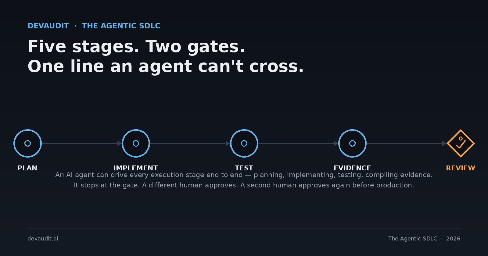

# The Agentic SDLC: Why 2026 Is the Year Software Engineering Gets a New Operating Model



> **Primary persona:** CTO · **Funnel stage:** TOFU — Awareness
> **Format:** Long-form (~2,500 words) · **Status:** Draft
> **Short-form companion:** [agentic-sdlc-short-form.md](agentic-sdlc-short-form.md)
> **Cross-links:** [/sdlc](https://devaudit.ai/sdlc) · [docs/skills.md](https://github.com/metasession-dev/DevAudit-Installer/blob/main/docs/skills.md) · [docs/change-workflows.md](https://github.com/metasession-dev/DevAudit-Installer/blob/main/docs/change-workflows.md)

> **Blog publishing fields** — the devaudit.ai blog stores posts as `{slug, title, excerpt, body, tags[], author}`, none of it derived automatically from this file. Paste these into the CMS admin form:
> - **Title:** The Agentic SDLC: Why 2026 Is the Year Software Engineering Gets a New Operating Model
> - **Slug:** `agentic-sdlc`
> - **Excerpt:** In 2025, AI finished your line. In 2026, it plans the requirement, writes the tests, compiles the evidence, and opens the PR — and stops. What a CTO actually needs to decide is where that stopping point goes, and how to prove it held.
> - **Author:** Metasession
> - **Tags:** `sdlc`, `ai-governance`, `engineering-leadership`

---

Ask an engineering leader what changed in AI-assisted development between 2025 and 2026, and most will describe a speed difference: the same autocomplete, just faster, with a bigger context window. That undersells what actually happened. The unit of work an AI tool operates on changed. In 2025, the unit was a line, or at most a function — Copilot finishes what you were already typing. In 2026, the unit is a requirement. An agent reads a GitHub issue, writes an implementation plan, implements it, writes the tests, compiles the evidence a reviewer will need, and opens the pull request. The human's job moved from "write this code" to "decide whether this plan, this evidence, and this PR are good enough to ship."

That's not a bigger autocomplete. That's the AI participating in the SDLC itself — planning, testing, and evidencing, not just typing. Calling 2026 the year the SDLC became agentic isn't a marketing frame; it's a description of where the unit of delegation moved.

For a CTO, this shift raises a question that autocomplete never did: if the agent is now doing the planning and the testing, not just the typing, where does its authority actually end? Get that boundary wrong in one direction and you've built a bottleneck — an agent that can draft code but still needs a human to babysit every intermediate step, which is just autocomplete with extra ceremony. Get it wrong in the other direction and you've built a liability — an agent that can merge its own work, approve its own evidence, and leave you unable to tell a SOC 2 auditor who actually signed off on a change six months from now.

## The real decision isn't "how much to automate"

It's tempting to frame this as a dial: more automation is more efficient, so turn it up until something breaks. That framing is wrong because it treats every step in the SDLC as equally safe to hand off. They aren't. Planning a requirement, writing tests against acceptance criteria, and compiling evidence are bounded, verifiable, and reversible — an agent can do all three well, and a human can check the output cheaply. Approving that a release is ready for production, and merging it, are neither bounded nor cheaply reversible — they're judgment calls with consequences that a plan or a test suite can't fully anticipate.

The distinction that actually matters isn't "how much of the SDLC is automated." It's "which parts of the SDLC are execution, and which are judgment." DevAudit's answer to the CTO's question is built around exactly that line: the AI does everything except approve and merge. Not because approval and merge are the only steps worth trusting a human with, but because they're the two steps where the cost of being wrong is asymmetric — where an agent that's 95% right the other 95% of the time still needs a human in the loop for the 5% that isn't reversible.

That line shows up concretely in how DevAudit's own SDLC framework is structured. Every requirement moves through five stages — plan, implement and test, compile evidence, submit for review, deploy — and an AI agent, working through the framework's orchestrating skill, can drive all five without a human touching a keyboard in between. What it can't do is skip the checkpoint at stage four, where a *different* person than whoever wrote the code has to actually look at the evidence and click approve, or the checkpoint at stage five, where a second approval is required before the change reaches production. Those aren't friction the framework tolerates. They're the whole point.

## The one-prompt demonstration, and what it doesn't skip

DevAudit's own product page for this puts the claim in the smallest form it can take: a single prompt.

```
> Implement issue #N under the SDLC.
```

That's the entire instruction a developer gives. What happens next is the orchestrator reading the issue, classifying the change, writing an implementation plan, pausing for approval if the risk classification calls for it, implementing the change, delegating test authoring to a specialist rather than writing tests inline, compiling the evidence a reviewer will actually need, and opening a pull request — then stopping. Not stopping because it ran out of things to do. Stopping because merging isn't its decision to make.

The demonstration is deliberately unglamorous. It doesn't show off code generation speed. It shows the boundary holding: five stages executed, two approvals still required, and — the part that's easy to overlook — a change-type triage step at the very front that decides how much of that ceremony a given change actually needs. Not every commit is a tracked feature. A typo fix, a CI tweak, a dependency bump doesn't need a formal requirement ID and a risk classification; it needs a lighter path that still goes through a PR and still waits its turn to be folded into the next real release, without the overhead of pretending it's something it isn't. Getting that triage right — automating the ceremony without over-applying it — turns out to be as much a governance decision as automating the work itself.

## One orchestrator, five specialists

The part of this that's easy to gloss over in a single-prompt demo is what's actually running underneath it. DevAudit ships six AI skills, not one. `sdlc-implementer` is the orchestrator — it owns phase routing, evidence checkpoints, PR readiness, and the resume/watch behavior that lets a human step away mid-implementation and pick the thread back up later. It doesn't do everything itself. It delegates.

- **`e2e-test-engineer`** owns the end-to-end test pack: proving each acceptance criterion actually holds, capturing per-criterion evidence at the point a test asserts it, and helping classify a failure when one shows up.
- **`governance-doc-author`** authors and refreshes the governance documents a compliance program actually needs — ROPA, DPIA, AI disclosure, incident response, periodic review — rather than leaving them as a task someone remembers to do before an audit.
- **`requirements-aligner`**, **`adr-author`**, and **`risk-register-keeper`** form what the framework calls the source-of-truth alignment family: they keep the requirements spec, the architecture-decision record, and the risk register honest against whatever just changed, and each drops its own per-requirement traceability artifact as evidence that the alignment actually happened, not just that someone claims it did.

The reason this matters architecturally, not just as a division of labor: an orchestrator that inlines test-writing, governance-authoring, and risk-tracking into one undifferentiated agent loop is an orchestrator you can't audit. You can't point to the artifact that proves the tests were written against the stated acceptance criteria, because there isn't a discrete step that produced one — it's all one blur of "the agent worked on it." Splitting the work into named specialists with defined outputs means every one of those outputs is independently checkable. A reviewer doesn't have to trust the orchestrator's summary of what happened; they can open `srs-alignment.md` and see exactly what `requirements-aligner` traced against exactly which requirement.

That's the structural difference between "AI helped write this" and "AI's involvement is documented well enough to survive an audit." The first is a marketing claim. The second is an evidence chain, and evidence chains are made of discrete, attributable steps — which is exactly what specialist delegation produces and an undifferentiated agent loop doesn't.

## Agent-agnostic, on purpose

There's a version of this pitch that would be easier to make and less useful to a CTO: build the governance layer as a Claude Code plugin, get the deepest integration on one vendor's tooling, and let everyone else fend for themselves. DevAudit doesn't do that, and the reason is a real engineering-leadership constraint, not an abstraction for its own sake — most engineering orgs aren't standardized on one AI coding tool, and the ones that think they are usually discover otherwise the first time a new hire shows up with a strong Cursor habit or a team lead prefers Windsurf's diff review.

The SDLC framework's skills sync into whichever agent a developer is actually using. Claude Code gets the deepest integration, because it can auto-discover and auto-fire a skill without being told to. Cursor, Windsurf, Gemini CLI, and Codex consume the same rules through `INSTRUCTIONS.md` and the same synced workflow documents — a different delivery mechanism, but the same five stages, the same two approval gates, the same evidence shape at the end. A requirement implemented by one engineer's Claude Code session and a regression fix implemented by another's Codex session land in the same audit trail, structured the same way, checkable by the same reviewer using the same portal view. The governance layer doesn't care which agent wrote the code. It cares whether the evidence is there.

For a CTO evaluating whether to standardize on this kind of framework, that's the practical test: does adopting it lock the org into one AI vendor's roadmap, or does it sit above the vendor choice entirely? An agent-agnostic SDLC means the governance investment survives a tooling change. The next AI coding agent that ships doesn't obsolete the framework — it just becomes one more agent the same five stages apply to.

## The gap this is actually closing

None of this matters much if the alternative is fine. It isn't. Recent industry surveys on AI governance adoption converge on a number worth sitting with: roughly 60% of enterprises report having no formal AI governance framework in place, even as AI tooling's role in their own software delivery has moved well past autocomplete. That's not a story about laggards ignoring an obvious best practice. It's a story about the tooling outrunning the governance model built for it — most existing change-management processes were designed around the assumption that a human wrote every line, and that assumption quietly stopped holding true sometime in the last two years.

The practical cost of that gap doesn't show up as a single incident. It shows up as accumulated exposure: a SOC 2 auditor asking who reviewed a change and getting a shrug, an EU AI Act technical-documentation requirement with no record of which tool touched which requirement, a security review that can't reconstruct why a given piece of production code exists because the "why" lived in a chat session nobody saved. None of that is hypothetical risk. It's the predictable result of governance processes that never updated their assumptions about who — or what — is doing the writing.

Closing that gap isn't a matter of writing a policy document and asking teams to follow it. Policy documents don't produce evidence; workflows do. The six-skill model, the two-gate approval structure, and the agent-agnostic sync are DevAudit's answer to a specific version of that problem: make the governed path the same path a developer already takes to ship a feature, so that following it isn't a compliance tax layered on top of real work — it *is* the real work, instrumented well enough to prove itself later.

## Where this leaves 2026

The honest framing isn't "AI writes better code now, so let it do more." It's that the unit of AI delegation crossed a threshold — from typing to planning, testing, and evidencing — and that threshold changes what governance has to look like. A code-review process built for human-authored diffs doesn't automatically know what to do when the diff arrived with a full implementation plan, a test suite, and a compiled evidence pack attached, produced by an agent that then stopped and waited. That's a good problem to have, but it's still a problem, and the organizations that treat it as one — rather than either banning agentic tooling out of caution or handing it the keys out of enthusiasm — are the ones that will still be able to answer an auditor's questions in 2027.

The agentic SDLC isn't a prediction. The tooling described here — the orchestrator, the five specialists, the two approval gates, the agent-agnostic sync — is running in production today, on real requirements, with real reviewers clicking real approvals. The question for 2026 isn't whether the SDLC becomes agentic. It's whether the governance layer around it gets built deliberately, or gets discovered missing during an audit.

Read the full manifesto for how the five stages, the three pillars, and the six skills fit together → [devaudit.ai/sdlc](https://devaudit.ai/sdlc)
