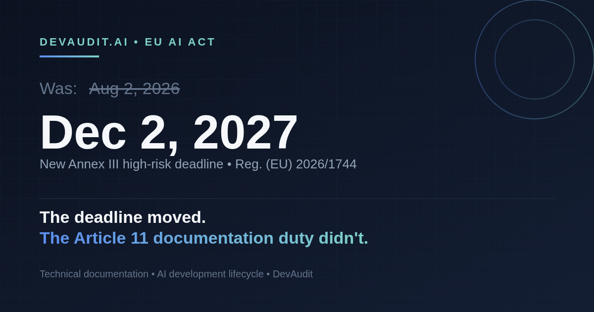

# The EU AI Act's High-Risk Deadline Just Moved to December 2027

> **Primary persona:** CISO · **Format:** Long-form (≤2800 characters) · **Status:** Draft, pending qualified legal review
> **Cross-links:** [/sdlc](https://devaudit.ai/sdlc) · [/compliance](https://devaudit.ai/compliance)

---

On July 27, 2026, Regulation (EU) 2026/1744 — the "Digital Omnibus on AI" — entered into force. It pushed the EU AI Act's high-risk-system deadline for standalone (Annex III) systems from August 2, 2026 to **December 2, 2027**. Product-embedded (Annex I) systems now have until August 2, 2028.

If your team's reaction was relief, read the regulation again. The deferral moves a date. It does not remove the obligation.

## What didn't change

Article 11 still requires providers of high-risk AI systems to maintain technical documentation of the system's development lifecycle — design choices, data, testing, risk management, and the tools and methods used to build it. If an AI coding agent touched code inside a regulated system, that involvement is part of the story Article 11 asks you to tell.

Article 99's penalty structure is untouched too: up to €35M or 7% of global turnover for Article 5 prohibited practices, up to €15M or 3% for other high-risk obligations including Article 11, and up to €7.5M or 1% for misleading regulators.

## The trap in "16 more months"

Sixteen months feels like room to breathe. It's actually room to lose the thread. Teams that stand down now will spend Q4 2027 trying to reconstruct which agent touched which requirement, under which review, eighteen months after the fact — instead of having captured it the day it happened.

Security teams are still watching the obvious surface: chatbots, recommendation engines, anything with "AI product" in the name. The AI agents writing the production code inside a regulated system are still the blind spot. A `Co-Authored-By` commit trailer is evidence of authorship. It is not technical documentation of a development lifecycle.

## Where DevAudit fits

DevAudit doesn't wait for a deadline to start building the record. `ai-use-note.md` captures the AI system description per requirement. `ai-prompts.md` captures the human-AI interaction that produced the change. Commitlint enforces the `Co-Authored-By` trailer so provenance isn't optional. None of it depends on when enforcement lands — it's just what shipping looks like.

The deadline moved. The work didn't.

---

*See the EU AI Act mapping → [devaudit.ai/compliance](https://devaudit.ai/compliance)*

*Read the SDLC manifesto → [devaudit.ai/sdlc](https://devaudit.ai/sdlc)*
