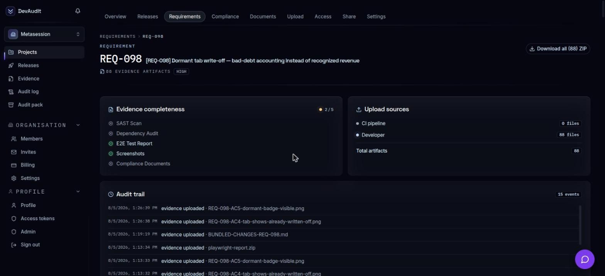
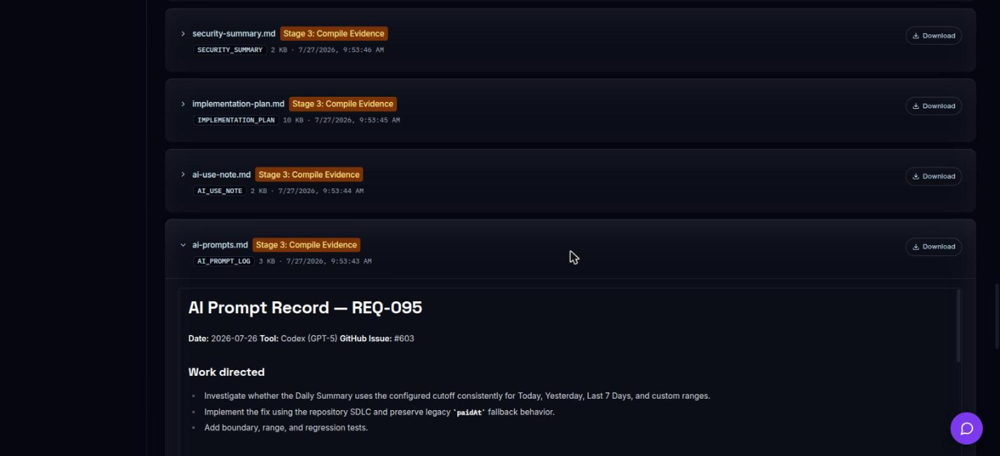
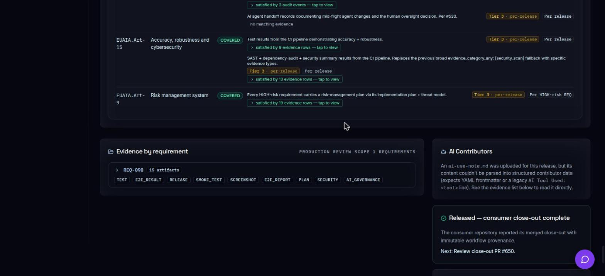

# The EU AI Act's High-Risk Deadline Just Moved to December 2027 — Don't Read That as "Stand Down"

> **Primary persona:** CISO · **Funnel stage:** TOFU — Awareness
> **Format:** Long-form (~2,200 words) · **Status:** Draft, pending qualified legal review
> **Short-form companion:** [eu-ai-act-deadline-deferred-short-form.md](eu-ai-act-deadline-deferred-short-form.md)
> **Cross-links:** [/sdlc](https://devaudit.ai/sdlc) · [/compliance](https://devaudit.ai/compliance) · [/onboarding](https://devaudit.ai/onboarding)

> **Blog publishing fields** — the devaudit.ai blog stores posts as `{slug, title, excerpt, body, tags[], author}`, none of it derived automatically from this file. Paste these into the CMS admin form:
> - **Title:** The EU AI Act's High-Risk Deadline Just Moved to December 2027 — Don't Read That as "Stand Down"
> - **Slug:** `eu-ai-act-deadline-deferred`
> - **Excerpt:** Regulation (EU) 2026/1744 pushed the high-risk deadline to December 2027 — but the Article 11 documentation duty didn't move with it. What that looks like on a real, released requirement.
> - **Author:** Metasession
> - **Tags:** `compliance`, `eu-ai-act`, `regulation`
>
> The 4 inline images (`images/eu-ai-act-*.png`/`.jpg`) are repo-relative and will not resolve on the live site — each needs uploading through the blog's CMS (`app/blog/uploads`) and its markdown reference swapped to the returned URL before publish. None of them function as the post's OG/social image — that's auto-generated server-side from title + author on a fixed template, with no per-post override.

---

On July 27, 2026, Regulation (EU) 2026/1744 — the "Digital Omnibus on AI" — entered into force. It pushed the EU AI Act's high-risk-system deadline for standalone systems (Annex III) from August 2, 2026 to **December 2, 2027**. Product-embedded systems (Annex I) now have until August 2, 2028. The regulation was published in the Official Journal on July 24, 2026, and the deferral is confirmed, in-force law — not a Commission proposal still working through committee.

If your team's reaction to that news was relief, it's worth reading the regulation again. The deferral moves a date. It does not remove the obligation, and it does not make the sixteen months in between free.

This piece has two parts. First, what actually changed and what didn't — including a claim from an earlier draft of this article that turned out not to hold up under a stricter reading. Second, what the documentation the Act asks for actually looks like in practice, using a real requirement from a project running DevAudit's SDLC in production — including a place where it didn't go perfectly, because that's more useful than a polished hypothetical.

## What didn't change

Article 11 still requires providers of high-risk AI systems to maintain technical documentation of the system's development lifecycle: design choices, data, testing, risk management, and — per Annex IV — the tools and methods used to build it. If an AI coding agent touched code inside a system that's high-risk under Annex III, that involvement is part of the story Article 11 asks a provider to tell.

One clarification that matters here: using Claude Code, Copilot, Cursor, or Windsurf doesn't itself make a system high-risk. Annex III's use-case list does that — employment, education, credit assessment, law enforcement, critical infrastructure, and a defined set of others. A team shipping an internal admin tool with an AI coding agent is not suddenly in scope because the agent wrote some of the code. But a team shipping a *high-risk* system with an AI coding agent is in scope for documenting that agent's role, deadline or no deadline.

Article 99's penalty structure is untouched by the deferral: up to €35M or 7% of global turnover for Article 5 prohibited practices, up to €15M or 3% for other high-risk obligations (Article 11 sits here), and up to €7.5M or 1% for supplying misleading information to regulators.

## Where AI tooling actually shows up in the Act

The earlier draft of this article claimed that Article 13 covers disclosure of which code blocks were AI-generated. That's not quite right, and it's worth correcting in public rather than quietly fixing: Article 13 is about high-risk systems being sufficiently transparent *to deployers* — instructions for use, not authorship disclosure. Getting specific about which article covers what turns out to matter, so here's the breakdown we're actually building DevAudit's evidence mapping around:

- **Article 11 (Annex IV) — technical documentation.** Satisfied by the implementation plan and RTM snapshot for a requirement: design specifications, the development methodology, what was built and why.
- **Article 12 — record-keeping of risk-relevant events.** Satisfied by an append-only audit log, or by a structured AI-prompt provenance record — what DevAudit calls `ai-prompts.md`.
- **Article 13 — transparency to deployers.** This is where an AI-use disclosure actually lands: a document listing every AI tool involved, its role, and human-oversight notes — what DevAudit calls `ai-use-note.md`. It refreshes every 180 days, or sooner if the tooling changes materially.

That's the live mapping in DevAudit's own compliance framework as of this writing. It's a defensible reading, not a settled one — which is exactly why this article, and the framework's own clause mappings, stay flagged for qualified legal review rather than presented as legal advice.

## What this looks like on a real release

Talk is cheap; here's a requirement that actually shipped. REQ-098 on the `wgb` project — a dormant-tab write-off feature for bad-debt accounting — was classified HIGH risk and released on August 3, 2026, with 88 evidence artifacts attached.

Its `ai-use-note.md` — the Article 13 artifact — is not a checkbox. It's a real account of what happened: the AI read the linked GitHub issue and verified every cited file against current code before drafting a plan; it invoked `requirements-aligner`, `adr-author`, and `risk-register-keeper` as sub-skills rather than handling architecture decisions inline; it paused at a HIGH-risk plan-approval checkpoint for the operator to review before implementation began; and — notably — it includes an "Honest framing of limitations" section admitting that a broader regression sweep didn't fully complete locally and had to rely on CI's environment instead. That's not the kind of thing a rubber-stamp compliance artifact says.

The three commits behind this requirement each carry a real `Co-Authored-By: Claude Sonnet 5 <noreply@anthropic.com>` trailer — plan, implementation, and tests, each a separate commit, each independently attributable. The release ticket lists the exact SHAs.

Here's the part that's more useful than a clean example: REQ-098 does **not** have an `ai-prompts.md`. The framework's own validation script flags this directly — `WARNING: AI use noted but ai-prompts.md missing for MEDIUM/HIGH risk` — because the rules require that artifact for MEDIUM/HIGH-risk work, and this HIGH-risk requirement shipped without it. The gate that's supposed to catch this fired correctly; the artifact still wasn't there when the release went out. That's not a story about DevAudit being flawless. It's a story about a framework whose whole premise is that gaps like this get surfaced instead of assumed away.

## What "complete" looks like

For contrast: REQ-095, a cutoff-consistency fix for daily reporting, also HIGH risk, also released, has both artifacts. Its `ai-prompts.md` records `Tool: Codex (GPT-5)` — a different AI coding agent entirely from the Claude Code work on REQ-098.

What makes this genuinely interesting rather than just a format example: later regression-fix commits on that same requirement carry `Co-Authored-By: Claude Sonnet 5`. Two different AI tools, two different sessions, one requirement, one evidence shape. That's the "agent-agnostic" claim DevAudit makes about its SDLC holding up under an actual mixed-tool workflow, not just a slide describing one.

## A gap worth naming

One more honest finding. The portal's release page includes an "AI Contributors" panel meant to show structured data — which tool, which model, how many commits — pulled automatically from `ai-use-note.md`. On both REQ-098 and REQ-095, it shows this instead:

> *"An `ai-use-note.md` was uploaded for this release, but its content couldn't be parsed into structured contributor data (expects YAML frontmatter or a legacy `AI Tool Used: <tool>` line). See the evidence list below to read it directly."*

This isn't a one-off. It happened on both requirements checked for this article, which suggests it's the current `ai-use-note.md` template producing something more useful to a human reader — full sentences, an honesty section, real narrative — than to the portal's structured-data parser, which wants YAML frontmatter or a one-line tool declaration it doesn't have. The content is there, verified, and readable. The automated summary panel just can't extract it yet. Worth knowing if you're building evidence tooling of your own: a document can satisfy the compliance requirement and still fail the UI that's supposed to summarize it.

## The trap in "sixteen more months"

Sixteen months feels like room to breathe. It's actually room to lose the thread. A team that stands down now on documenting AI-agent involvement will spend Q4 2027 trying to reconstruct which agent touched which requirement, under which review, more than a year after the fact — instead of having captured it, as REQ-098 and REQ-095 did, on the day it happened.

Security teams are still mostly watching the obvious surface: chatbots, recommendation engines, anything with "AI product" in its name. The AI agents writing production code inside a regulated system are still the blind spot, deferral or not. A `Co-Authored-By` commit trailer is evidence of authorship. On its own, it's not technical documentation of a development lifecycle — that's what the surrounding artifacts, imperfect as they sometimes are, are for.

## Where DevAudit fits

DevAudit doesn't wait for an enforcement date to start the record. `ai-use-note.md` builds the Article 13 disclosure per requirement. `ai-prompts.md`, when the gate catches its absence and it gets added, builds the Article 12 record. The implementation plan builds the Article 11 documentation. None of it depends on when enforcement lands — it's just what shipping looks like, gaps included, because a framework that only ever shows clean examples isn't one you can trust the gaps in.

The deadline moved. The work didn't.

---

*Try the SDLC yourself → [devaudit.ai/onboarding](https://devaudit.ai/onboarding)*

*See the full EU AI Act mapping → [devaudit.ai/compliance](https://devaudit.ai/compliance)*

*Read the SDLC manifesto → [devaudit.ai/sdlc](https://devaudit.ai/sdlc)*
